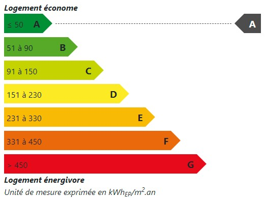

# NG Bilan Energétique

Cette librairie Angular a pour but de mettre à disposition différents calculs et mises en forme en ce qui concerne les bilans énergétiques des bâtiments.

## Installation

```bash
$ #Installation de la dépendance  
$ npm i --save ng-bilan-energetique
```

Pour utiliser les fonctionnalités autour des Déperditions Énergétiques :  

```typescript
@NgModule({
    declarations: [],
    imports: [
        DpeModule,
    ],
    exports: []
})
export class AppModule {
}
```

## Fonctionnalités
### Sélecteur de déperdition énergétique


```html
<be-dpe-scale [selectable]="true" (changed)="updateNote($event)" [value]="'A'"></be-dpe-scale>
```


## Notes
Ce README est rédigé en Français car ce package a pour but d'être utilisé seulement par des projets Français. (Étant donné la nature des calculs et représentations)
